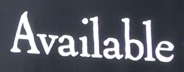

# FAN-PyTorch

## Overview

This repository contains an op-for-op PyTorch reimplementation
of [Focusing Attention: Towards Accurate Text Recognition in Natural Images](https://arxiv.org/abs/1709.02054v3).

## Table of contents

- [FAN-PyTorch](#fan-pytorch)
    - [Overview](#overview)
    - [Table of contents](#table-of-contents)
    - [Download weights](#download-weights)
    - [Download datasets](#download-datasets)
    - [How Test and Train](#how-test-and-train)
        - [Test](#test)
        - [Train CRNN model](#train-crnn-model)
        - [Resume train CRNN model](#resume-train-crnn-model)
    - [Result](#result)
    - [Contributing](#contributing)
    - [Credit](#credit)
        - [Focusing Attention: Towards Accurate Text Recognition in Natural Images](#focusing-attention-towards-accurate-text-recognition-in-natural-images)

## Download weights

- [Google Driver](https://drive.google.com/drive/folders/17ju2HN7Y6pyPK2CC_AqnAfTOe9_3hCQ8?usp=sharing)
- [Baidu Driver](https://pan.baidu.com/s/1yNs4rqIb004-NKEdKBJtYg?pwd=llot)

## Download datasets

Contains ICDAR2013~2019, MJSynth, SynthText, SynthAdd, Verisimilar Synthesis, UnrealText and more, etc.

- [Google Driver](https://drive.google.com/drive/folders/1CwkA0gKd4bnj66W0l6CB14sx-aAe3WOE?usp=sharing)
- [Baidu Driver](https://pan.baidu.com/s/1v31aBT5phe5Ci6N0Wsn3xQ?pwd=llot)

Please refer to `README.md` in the `data` directory for the method of making a dataset.

## How Test and Train

Both training and testing only need to modify the `config.py` file.

### Test

- line 29: `chars_dict_path` change to `./data/MJSynth/chars.txt`.
- line 39: `mode` change to `test`.
- line 81: `model_path` change to `results/pretrained_models/FAN-MJSynth-e9341ede.pth.tar`.

### Train CRNN model

- line 29: `chars_dict_path` change to `./data/MJSynth/chars.txt`.
- line 39: `mode` change to `train`.
- line 41: `exp_name` change to `FAN_MJSynth`.

### Resume train CRNN model

- line 29: `chars_dict_path` change to `./data/MJSynth/chars.txt`.
- line 40: `mode` change to `train`.
- line 41: `exp_name` change to `FAN_MJSynth`.
- line 55: `resume` change to `samples/FAN_MJSynth/epoch_xxx.pth.tar`.

## Result

Source of original paper results: [https://arxiv.org/pdf/1709.02054v3.pdf](https://arxiv.org/pdf/1709.02054v3.pdf)

In the following table, `-` indicates show no test.

|   Model    | IIIT5K (None) | SVT (None) | IC03 (None) | IC13 (None) | IC15 (None) |
|:----------:|:-------------:|:----------:|:-----------:|:-----------:|:-----------:|
| FAN(paper) |    87.4.2     |    85.9    |    94.2     |    93.3     |    70.6     |
| FAN(repo)  |     **-**     |   **-**    |    **-**    |    **-**    |    **-**    |

```bash
# Download `FAN-MJSynth-e9341ede.pth.tar` weights to `./results/pretrained_models`
# More detail see `README.md<Download weights>`
python predict.py --image_path ./figures/Available.png --weights_path ./results/pretrained_models/FAN-MJSynth-e9341ede.pth.tar
```

Input: <span align="center"></span>

Output:

```text
Build FAN model successfully.
Load FAN model weights `./results/pretrained_models/FAN-MJSynth-e9341ede.pth.tar` successfully.
``./figures/Available.png` -> `available`
```

## Contributing

If you find a bug, create a GitHub issue, or even better, submit a pull request. Similarly, if you have questions,
simply post them as GitHub issues.

I look forward to seeing what the community does with these models!

## Credit

### Focusing Attention: Towards Accurate Text Recognition in Natural Images

_Zhanzhan Cheng, Fan Bai, Yunlu Xu, Gang Zheng, Shiliang Pu, Shuigeng Zhou_ <br>

**Abstract** <br>
Scene text recognition has been a hot research topic in computer vision due to its various applications. The state of
the art is the attention-based encoder-decoder framework that learns the mapping between input images and output
sequences in a purely data-driven way. However, we observe that existing attention-based methods perform poorly on
complicated and/or low-quality images. One major reason is that existing methods cannot get accurate alignments between
feature areas and targets for such images. We call this phenomenon "attention drift". To tackle this problem, in this
paper we propose the FAN (the abbreviation of Focusing Attention Network) method that employs a focusing attention
mechanism to automatically draw back the drifted attention. FAN consists of two major components: an attention network (
AN) that is responsible for recognizing character targets as in the existing methods, and a focusing network (FN) that
is responsible for adjusting attention by evaluating whether AN pays attention properly on the target areas in the
images. Furthermore, different from the existing methods, we adopt a ResNet-based network to enrich deep representations
of scene text images. Extensive experiments on various benchmarks, including the IIIT5k, SVT and ICDAR datasets, show
that the FAN method substantially outperforms the existing methods.

[[Paper]](https://arxiv.org/pdf/1709.02054v3)

```bibtex
@article{DBLP:journals/corr/abs-1709-02054,
  author    = {Zhanzhan Cheng and
               Fan Bai and
               Yunlu Xu and
               Gang Zheng and
               Shiliang Pu and
               Shuigeng Zhou},
  title     = {Focusing Attention: Towards Accurate Text Recognition in Natural Images},
  journal   = {CoRR},
  volume    = {abs/1709.02054},
  year      = {2017},
  url       = {http://arxiv.org/abs/1709.02054},
  eprinttype = {arXiv},
  eprint    = {1709.02054},
  timestamp = {Fri, 13 Aug 2021 07:43:49 +0200},
  biburl    = {https://dblp.org/rec/journals/corr/abs-1709-02054.bib},
  bibsource = {dblp computer science bibliography, https://dblp.org}
}
```

